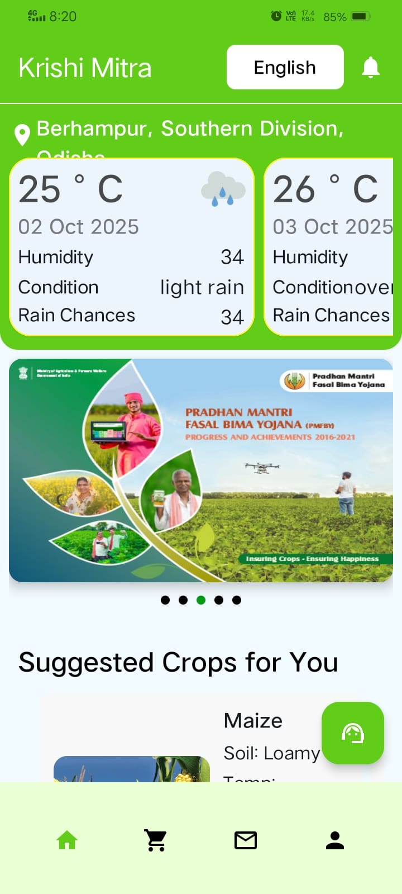
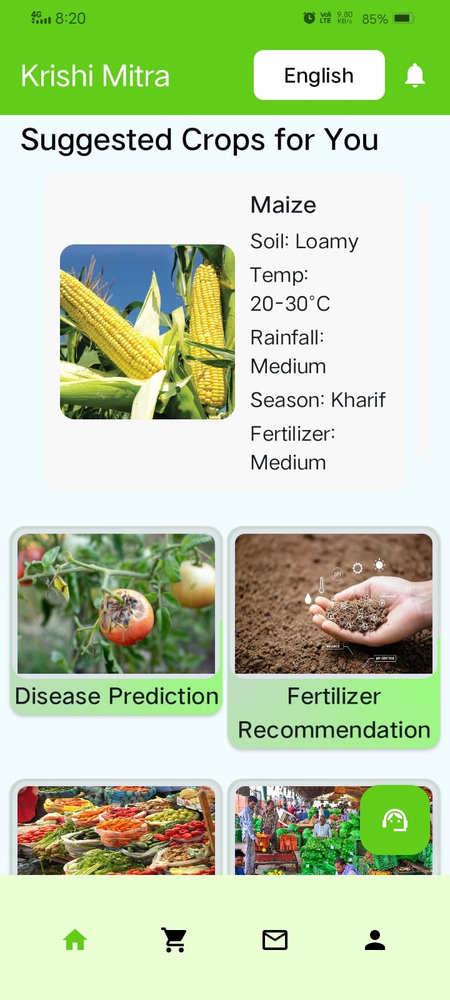
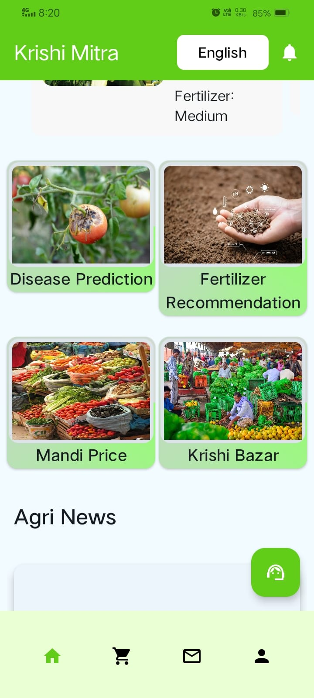
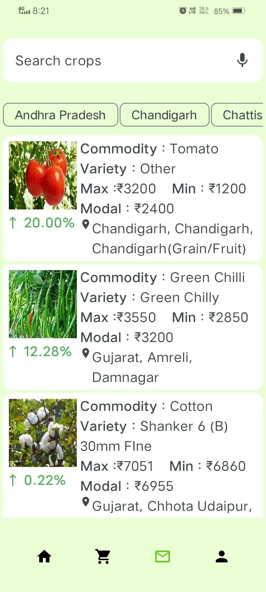
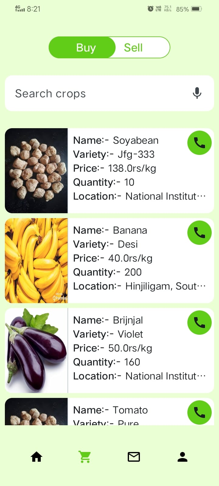
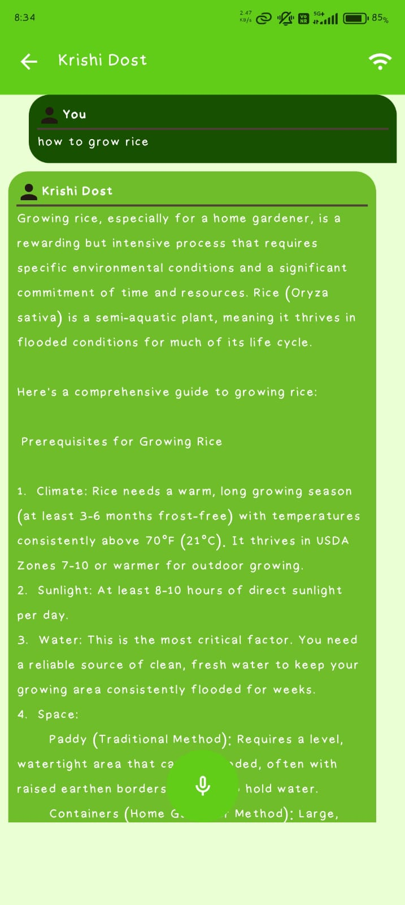
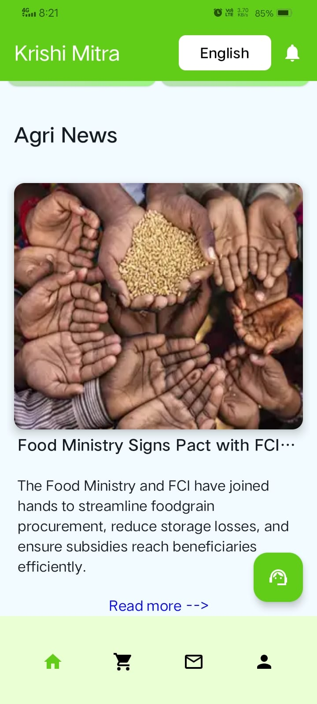
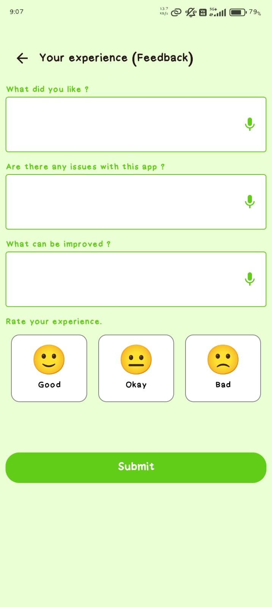

  
  
The Krishi Mitra Login Page provides a clean, user-friendly gateway to the smart advisory system, featuring input fields for Email and Password against a relevant background of a sprinkler-irrigated field. A prominent Language Selector and a link to Create an account ensure simple, accessible onboarding for all small and marginal farmers.

---

  
  
The Krishi Mitra Home Page acts as a personalized dashboard, instantly displaying the user's location and a two-day weather forecast critical for farming decisions. Below the weather, a carousel highlights key agricultural government schemes (like PMFBY), followed by tailored Suggested Crops recommendations, all accessible via a clean navigation bar.

---

  
  
The Suggested Crops for You page leverages AI to display the optimal crop (e.g., Maize) based on the user's soil type, temperature, and rainfall data, providing essential farming parameters. This section also acts as a primary feature hub, offering quick access to Disease Prediction and Fertilizer Recommendation tools.

---

  
  
The central Features Page serves as the navigational core of the app, visually organizing the main advisory services: Disease Prediction, Fertilizer Recommendation, Mandi Price, and Krishi Bazar. This clean interface allows farmers to quickly jump to the specific AI tool or market resource they need.

---

  
  
The Disease Prediction feature uses image analysis to instantly identify a plant ailment (e.g., Leaf Blight), providing the diagnosis, confidence level, simple description, and actionable Treatment and Precautions steps. This tool gives farmers rapid, science-backed advice to minimize crop loss.

---

  
  
The Mandi Price section provides essential market intelligence, allowing farmers to track the Max, Min, and Modal prices of commodities across various states and markets. By showing price changes and location data, this tool helps farmers decide the best time and place to sell their crops for maximum profit.

---

  
  
The Krishi Bazar (Buy/Sell) page connects farmers directly, allowing them to list crops (like Soybean, Banana, or Brinjal) by variety, price, and quantity. The integrated call button and simple listing format create a direct-to-consumer platform, reducing reliance on middlemen and streamlining transactions.

---

  
  
The Krishi Dost Chatbot offers instant, detailed text and voice-supported guidance on general farming queries, such as "how to grow rice." This feature ensures that even low-literate users can receive comprehensive, step-by-step information on prerequisites, climate, and water management without searching the entire app.

---

  
  
The Agri News section keeps farmers informed with the latest agricultural updates, policies, and market movements relevant to their sector (e.g., Food Ministry Pacts). This centralized news feed ensures users remain aware of important government initiatives, subsidy changes, and industry trends that affect their livelihood.

---

    
    
The Feedback page, titled Your experience (Feedback), provides a simple, structured form for user input, including text fields for "What did you like?", "Are there any issues?", and "What can be improved?". Critically, it includes a simple emoji-based rating (Good, Okay, Bad) and voice input icons next to each field to ensure accessibility for low-literate farmers.

